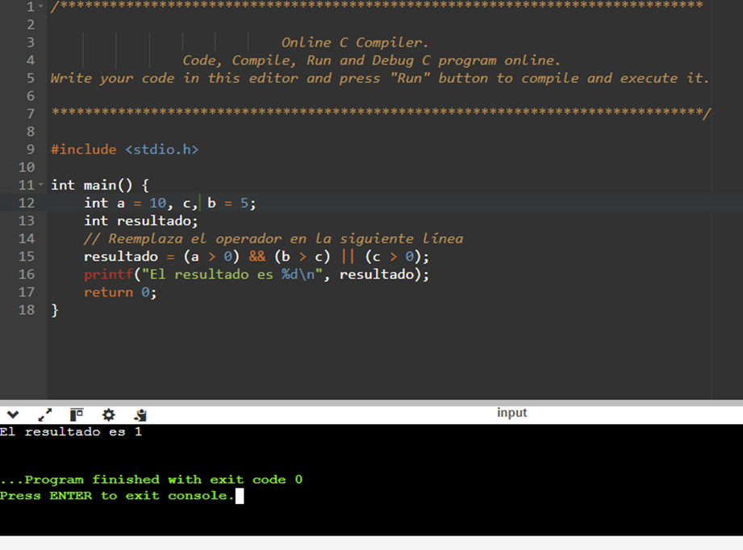
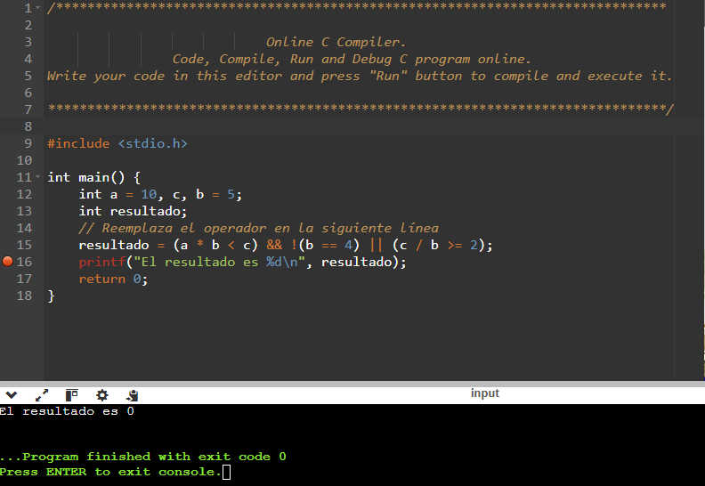
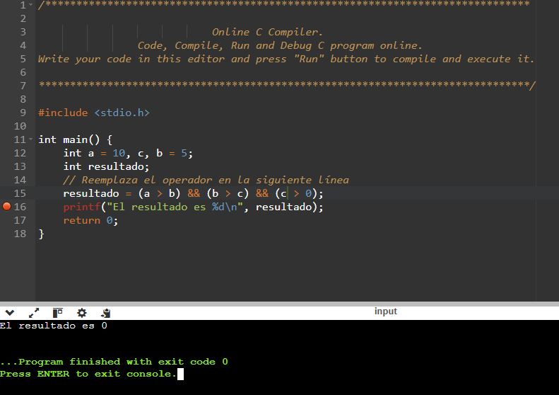

## Actividades bitácora

## Probando Operadores Relacionales

1.

2.

3.

## Ejercicio con switch

## Menú Repetitivo con un Bucle

pregunta: 

¿Cómo podrías modificar el programa del menú para que, después de ejecutar una opción, te vuelva a preguntar qué quieres hacer?

-Respuesta: 

para lograr ese efecto de bucle se utilizaría `Do while`, con este se lograría ejecutar la condición las veces que se desean siempre y cuando se cumpla con una determinada condición.

## Ejercicios propuestos

