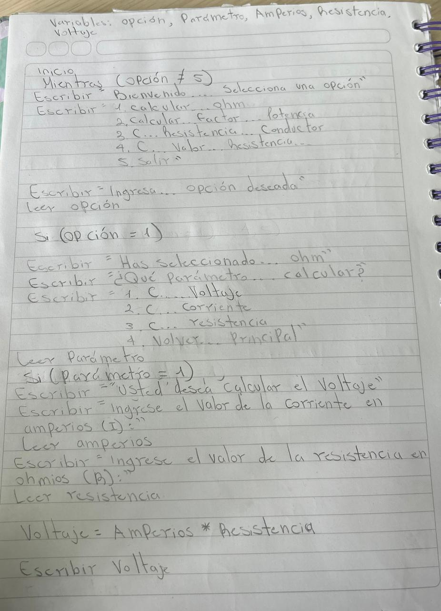

## Evidencia retos versión 1.0

| Función                                   | Descripción |
|-------------------------------------------|-------------|
| `int menu(void);`                         | Muestra el menú principal y las opciones a elegir para el usuario. |
| `int submenu_ohm(void);`                  | Muestra el submenú de la Ley de Ohm. |
| `float calcular_voltaje(float, float);`   | Calcula el voltaje usando la Ley de Ohm. |
| `float calcular_corriente(float, float);` | Calcula la corriente usando la Ley de Ohm. |
| `float calcular_resistencia(float, float);` | Calcula la resistencia usando la Ley de Ohm. |
| `int submenu_f_potencia(void);`           | Muestra el submenú de Factor de Potencia. |
| `float calcular_potencia_activa(float, float, float);` | Calcula la potencia activa. |
| `float calcular_potencia_aparente(float, float);` | Calcula la potencia aparente. |
| `float calcular_factor_potencia(float, float);` | Calcula el factor de potencia. |
| `void calcular_resistencia_led(void);`    | Calcula la resistencia necesaria para un LED en serie o paralelo. |
| `void calcular_resistencia_conductor(void);` | Calcula la resistencia de un conductor dependiendo del material. |

| Función                          | Variable de Entrada           |
|----------------------------------|-------------------------------|
| **main()**                       | opcion, parametro             |
| **calcular_voltaje()**           | corriente, resistencia        |
| **calcular_corriente()**         | voltaje, resistencia          |
| **calcular_resistencia()**       | voltaje, corriente            |
| **calcular_potencia_activa()**   | voltaje, corriente, factor_potencia |
| **calcular_potencia_aparente()** | voltaje, corriente            |
| **calcular_factor_potencia()**   | potencia_Ac, potencia_Ap      |
| **calcular_resistencia_led()**   | V_fuente, V_f, I_f, num_leds, conexion |
| **calcular_resistencia_conductor()** | longitud, area, temperatura, opcion_material |

| Función                          | Variable de Salida            |
|----------------------------------|-------------------------------|
| **main()**                       | resultado, potencia_Ac, potencia_Ap, factor_potencia |
| **calcular_voltaje()**           | voltaje                       |
| **calcular_corriente()**         | corriente                     |
| **calcular_resistencia()**       | resistencia                   |
| **calcular_potencia_activa()**   | potencia_Ac                   |
| **calcular_potencia_aparente()** | potencia_Ap                   |
| **calcular_factor_potencia()**   | factor_potencia               |
| **calcular_resistencia_led()**   | R, P_R, P_Total, I_Total      |
| **calcular_resistencia_conductor()** | resistencia               |

| Constante                       | Valor                          |
|----------------------------------|--------------------------------|
| **RESISTIVIDAD_ORO**             | Valor de la resistividad del oro |
| **COEF_TEMP_ORO**                | Coeficiente de temperatura del oro |
| **RESISTIVIDAD_ALUMINIO**        | Valor de la resistividad del aluminio |
| **COEF_TEMP_ALUMINIO**           | Coeficiente de temperatura del aluminio |
| **RESISTIVIDAD_COBRE**           | Valor de la resistividad del cobre |
| **COEF_TEMP_COBRE**              | Coeficiente de temperatura del cobre |
